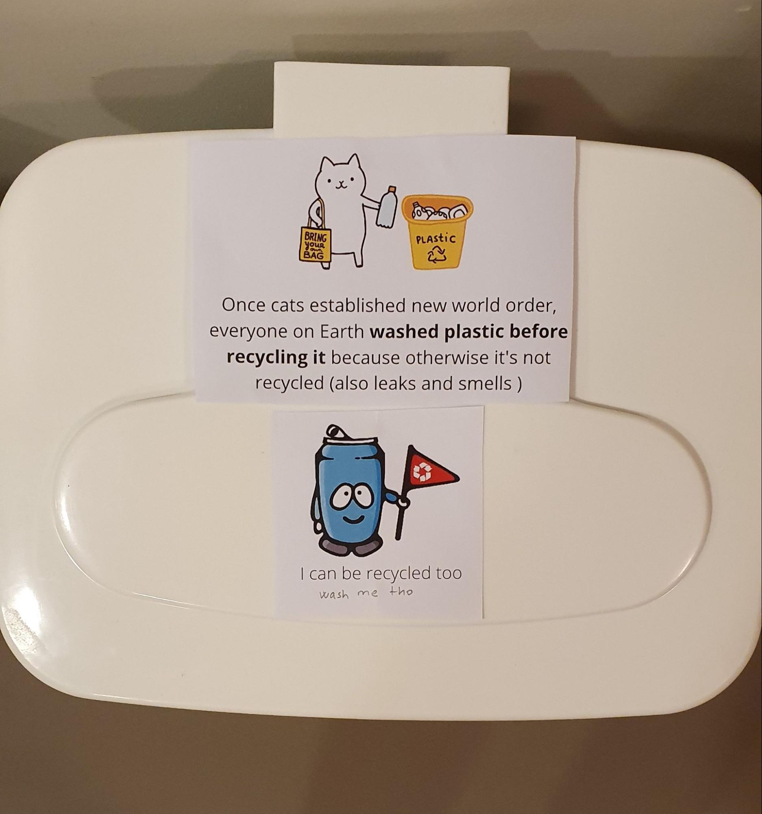

# nyuad-recycling-signs
Cute signs that nudge and guide students to recycle

## Introduction
After taking the Class Plastic Fantastic, my friend Hannah Greene made me realise I had been recycling incorrectly. All plastic should be washed before it is recycled, otherwise, it will be thrown into the general trash. What is more, a dirty load of plastic will contaminate the big trash can in the refuse room and make the effort of the whole building go to waste. The same goes for plastic straws and tissues. Many people throw tissues into recycling but tissues cannot be recycled. Masks should be recycled separately as well. 

## Problem statement

Recycling rules change by country and community. Hence, it is important that we follow local guidelines. Although I am happy that some infrastructure for recycling is in place at New York University Abu Dhabi (e.g. trashcans around campus, big recycling cans in each building), I observed that many students do not participate in recycling in their dorm rooms. The key reasons I identified for this behaviour are:  

* lack of incentives 
* lack of recycling infrastructure close to the place of waste production within dorm rooms
* lack of knowledge
* recycling contamination and hence destroying the value that others created by recycling (["when materials are sorted into the wrong recycling bin"](https://www.rubicon.com/blog/recycling-contamination/))

## Project purpose

Building on my knowledge of student life at dorm rooms, this campaign is an invitation for the community to create infrastructure to recycle within their own dorm rooms. No such infrastructure currently exists at dorm-room level, which makes it less likely that students will recycle. Furthermore, building recycling habits is a desired transformation.  

The pictures are 'cute', respond to campus culture (e.g. campus cats) and include an educational description. although not included here right now, I suggest also including pure text labels such as 'Plastic' and 'Paper' in addition to the pictures (feel free to add them into the repository here or send them to me). 

## Action items:

### Action item 1: Use these pre-made signs in your dorm
Print [this pdf with signs](https://bit.ly/3zqpHiG) and tape them on dedicated trash cans in your room. Involve your roommates by pooling in trashcans or use paper bags or old Amazon or convenience store boxes. 

<object data="recycling-signs.pdf" type="application/pdf">
    <embed src="https://bit.ly/3zqpHiG">
        
Please download the PDF to view it: <a href="https://bit.ly/3zqpHiG">Download PDF</a>.

    </embed>
</object>

### Action item 2: Place this call to action poster somewhere in your building 
Spread the word. For example print [this call to action pdf](https://bit.ly/3kvCiLh) with link to the images and tape in the refuse room in your building or on your floor

<object data="recruit-poster.pdf" type="application/pdf">
    <embed src="recruit-poster.pdf">
        
Please download the PDF to view it: <a href="https://bit.ly/3kvCiLh">Download PDF</a>.

    </embed>
</object>

### Action item 3: Modify the signs in Canva
Here is a [Canva link](https://www.canva.com/design/DAEoNXc-CSo/AZLSTdEgBs8STvsxkYUTyA/view?utm_content=DAEoNXc-CSo&utm_campaign=designshare&utm_medium=link&utm_source=sharebutton&mode=preview ) that allows you to continue editing and make it your own if you need to 

 
## Image sources 
Can picture.     
Lisa McTigue Pierce, ‘Aluminum can recycling raises $150,000-plus for charity’, Packaging Digest,https://www.packagingdigest.com/smart-packaging/aluminum-can-recycling-raises-150000-plus-charity

Groot picture. 
Cloudcity7.com, Pinterest,  https://id.pinterest.com/pin/741616263610638098/ 

Cat picture. 
Kostolom3000,Shutterstock, https://www.shutterstock.com/image-vector/funny-cat-holding-plastic-bottle-zero-1217168938?src=Hsxp8RgVd8xQ5mZmqrWLWg-1-0 

Banana picture.  
Freak, Pinterest, https://in.pinterest.com/pin/333125703690514216/
This one says free pics in description so i guess its okay

Food waste picture (altered).    
NoFoodWasted, http://www.nofoodwasted.com/ 

Mask.   
Shmelka2611, Shutterstock, https://www.shutterstock.com/image-illustration/woman-medical-protective-mask-against-coronavirus-1686785050 

